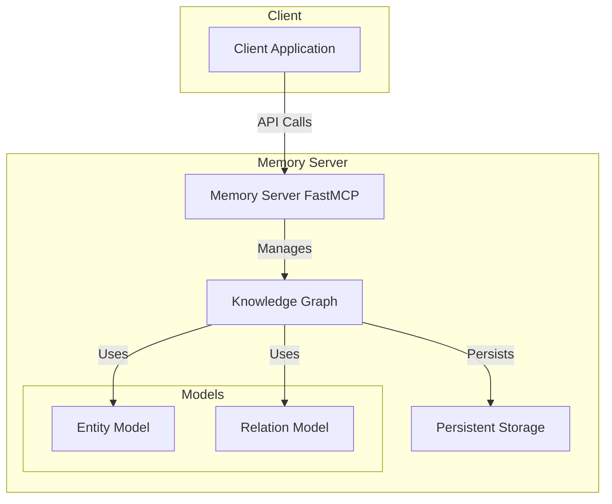

# Ontology Project

A Python-based knowledge graph system that implements a persistent memory server for managing entities, relations, and observations. The system provides a FastAPI-based interface for creating, querying, and managing a graph-based knowledge representation.

## Architecture



## Features

- **Entity Management**: Create, delete, and manage entities with types and observations
- **Relation Management**: Create and manage relationships between entities
- **Observation System**: Add and delete observations for entities
- **Persistent Storage**: JSON-based file storage with atomic operations
- **Search Capabilities**: Search entities by name or observation content
- **Type-Safe Implementation**: Fully typed with Python type hints
- **Async API Interface**: FastMCP-based asynchronous API
- **Error Handling**: Comprehensive error handling and logging

## Project Structure

```
ontology/
├── memory_server.py    # FastMCP server implementation
├── knowledge_graph.py  # Core knowledge graph implementation
└── models.py          # Data models for entities and relations
```

## API Reference

### Entity Operations
- `create_entities`: Create new entities with types and optional observations
- `delete_entities`: Remove entities and their relations
- `add_observations`: Add observations to existing entities
- `delete_observations`: Remove specific observations from entities

### Relation Operations
- `create_relations`: Create new relations between entities
- `delete_relations`: Remove specific relations from the graph

### Query Operations
- `read_graph`: Retrieve the entire knowledge graph
- `search_nodes`: Search for nodes by name or observation content
- `open_nodes`: Open specific nodes and their relations

## Development Setup

### Prerequisites

- Python 3.10 or higher
- pip (Python package installer)
- A virtual environment tool (venv, conda, etc.)

### Environment Setup

1. Create and activate a virtual environment:
```bash
python -m venv .venv
source .venv/bin/activate  # On Windows use: .venv\Scripts\activate
```

2. Install development dependencies:
```bash
pip install -e ".[test,dev]"
```

### Configuration

The system can be configured using environment variables:

- `MEMORY_FILE_NAME`: Name of the storage file (default: "memory.json")
- `LOCAL_STORAGE`: Whether to use local storage (default: false)
- `MEMORY_FILE_PATH`: Path for storing the memory file (default: ".")

### Running Tests

Run the full test suite with coverage:
```bash
pytest
```

Run specific test files:
```bash
pytest tests/test_memory_server.py
```

### Code Quality

Format and lint your code:
```bash
ruff check .
ruff format .
```

Run type checking:
```bash
mypy ontology tests
```

## Implementation Details

### Knowledge Graph
- Uses a combination of dictionaries and lists for efficient entity and relation storage
- Implements atomic file operations for data persistence
- Provides flexible search and query capabilities
- Maintains data consistency through validation

### Memory Server
- Implements FastMCP for API interface
- Provides asynchronous operations
- Includes comprehensive logging
- Implements singleton pattern for graph management

### Data Models
- Uses dataclasses for clean and type-safe data structures
- Implements Entity and Relation models
- Provides clear interface for data manipulation

## Error Handling

The system implements a custom `MemoryError` exception class and includes:
- Validation of entity and relation existence
- JSON parsing error handling
- File I/O error handling
- Duplicate entity detection

## Performance Considerations

- Efficient in-memory storage using dictionaries for O(1) entity lookup
- Atomic file operations for data persistence
- Lazy loading of graph data
- Optimized search operations

## License

See the LICENSE file for details.
